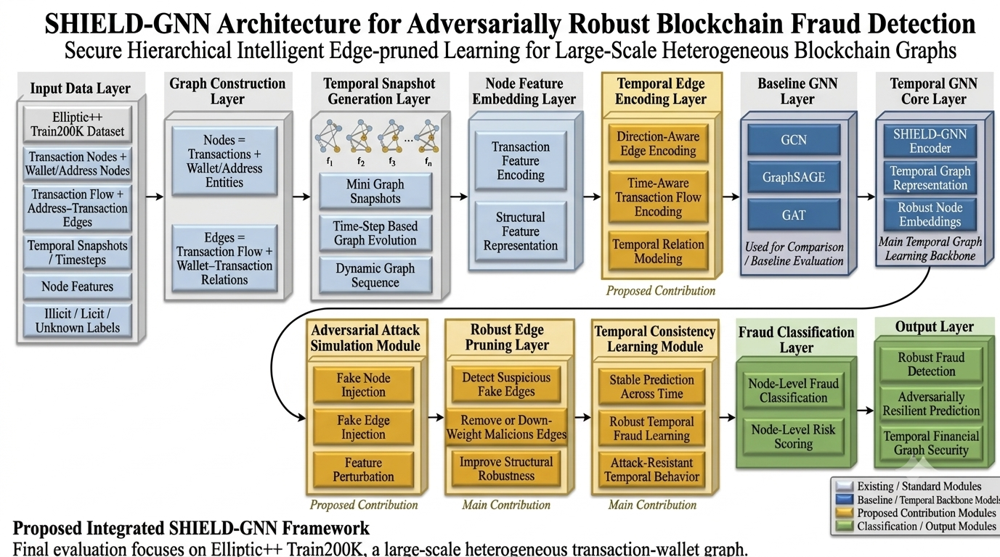
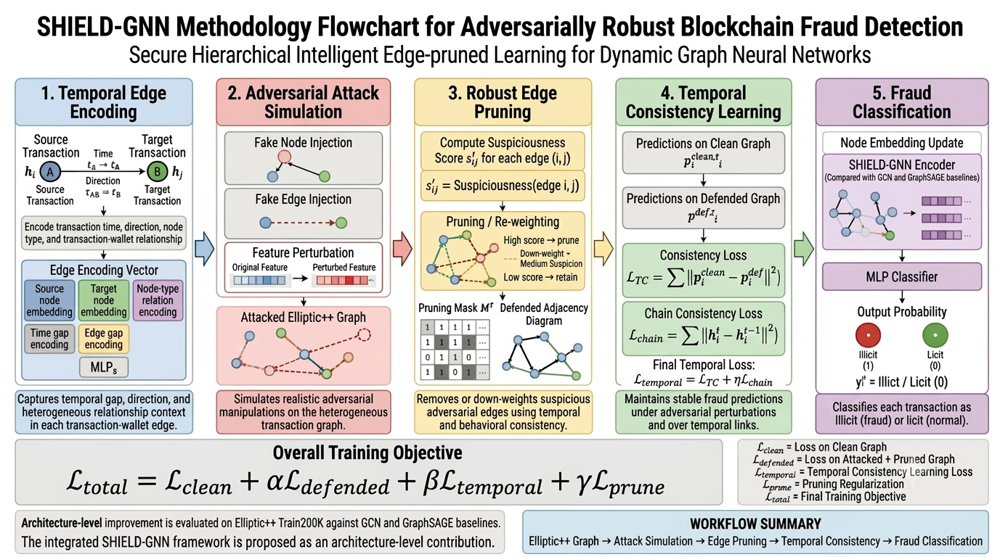

# SHIELD-GNN: Secure Hierarchical Intelligent Edge-pruned Learning for Adversarially Robust Blockchain Fraud Detection

SHIELD-GNN is a graph neural network research framework for adversarially robust blockchain fraud detection. It models blockchain activity as a heterogeneous graph of transaction nodes and wallet/address nodes, then evaluates standard GNN baselines and the proposed SHIELD-GNN architecture on the Elliptic++ Train200K benchmark.

The final research story is centered on Elliptic++ Train200K, where SHIELD-GNN improves over GCN and GraphSAGE baselines. The evidence supports SHIELD-GNN as an integrated architecture; it does not overclaim that every individual component is independently proven superior.

## Key Contributions

- Large-scale heterogeneous blockchain graph fraud detection with transaction and wallet/address nodes.
- Temporal graph representation and temporal edge encoding for transaction dynamics.
- Adversarial attack simulation for stress-testing graph fraud detectors.
- Robust edge pruning for defense-aware graph learning.
- Temporal consistency learning for stability across graph snapshots.
- Architecture-level improvement over GCN and GraphSAGE on Elliptic++ Train200K.

## Repository Structure

```text
Shield_GNN1/
  src/                 Core Python package and model code
  training/            Training entrypoint copies and notes
  evaluation/          Evaluation entrypoint copies and notes
  inference/           Inference/scoring notes
  datasets/            Dataset instructions and small metadata only
  checkpoints/         Curated final small checkpoints
  reports/             Final documents, tables, and audits
  figures/             Final result plots
  architecture/        Architecture diagram and methodology flowchart
  docs/                Methodology, experiments, dataset, and Git upload docs
  scripts/             Reproducibility and setup scripts
  paper_assets/        Publication-ready diagrams and LaTeX tables
```

## Architecture



## Methodology Flowchart



## Dataset: Elliptic++ Train200K

| Item | Value |
| --- | ---: |
| Total nodes | 1,026,711 |
| Transaction nodes | 203,769 |
| Wallet/address nodes | 822,942 |
| Undirected edges | 3,005,230 |
| Feature dimension | 249 |
| Labeled nodes | 311,918 |
| Train labeled nodes | 207,014 |
| Validation labeled nodes | 8,642 |
| Test labeled nodes | 6,687 |

Large raw and processed data files are not redistributed. See `datasets/README.md` and `docs/DATASET.md` for the expected local folder structure and graph-artifact build process.

## Methodology

SHIELD-GNN builds a heterogeneous blockchain graph from transactions and wallet/address entities. The pipeline constructs temporal graph snapshots, trains baseline GNNs, simulates graph attacks, applies robust edge pruning, and optimizes a SHIELD-GNN objective for fraud classification.

```text
L_total = L_clean + alpha L_defended + beta L_temporal + gamma L_prune
```

## Environment Setup

```cmd
py -3.12 -m venv shield_env
shield_env\Scripts\activate
python -m pip install --upgrade pip setuptools wheel
pip install -r requirements.txt
```

For CUDA training, install the PyTorch build matching your GPU and CUDA driver before installing `torch-geometric`.

## Dataset Preparation

```cmd
python src\build_ellipticpp_train200k_graph.py --input-dir datasets\raw\ellipticpp --output-dir data\processed\ellipticpp_train200k\graph_artifacts
python scripts\verify_ellipticpp_train200k_graph.py
```

## Training

```cmd
python src\train_baseline.py --model gcn --artifact-dir data\processed\ellipticpp_train200k\graph_artifacts --epochs 100 --hidden-channels 32 --num-layers 1 --dropout 0.5 --lr 0.001 --device cuda
python src\train_baseline.py --model graphsage --artifact-dir data\processed\ellipticpp_train200k\graph_artifacts --epochs 100 --hidden-channels 32 --num-layers 1 --dropout 0.5 --lr 0.001 --device cuda
python src\train_shield_gnn.py --artifact-dir data\processed\ellipticpp_train200k\graph_artifacts --epochs 100 --hidden-channels 32 --num-layers 1 --dropout 0.5 --lr 0.001 --device cuda --save-name shield_clean_ellipticpp_train200k_100ep_memsafe
python src\train_shield_gnn.py --artifact-dir data\processed\ellipticpp_train200k\graph_artifacts --epochs 100 --hidden-channels 32 --num-layers 1 --dropout 0.5 --lr 0.001 --device cuda --attack-mode combined --defense-mode prune --save-name shield_attack_defense_ellipticpp_train200k_100ep_memsafe
```

## Evaluation

```cmd
python src\evaluate_shield_gnn.py --artifact-dir data\processed\ellipticpp_train200k\graph_artifacts --checkpoint checkpoints\shield_clean_ellipticpp_train200k_100ep_memsafe_best.pt --device cuda
python src\evaluate_robustness_table.py --artifact-dir data\processed\ellipticpp_train200k\graph_artifacts --device cuda
python src\generate_results_section_docx.py
```

## Inference

A separate production inference CLI was not finalized. For reproducible scoring, use the evaluation scripts and checkpoints documented in `inference/README.md`.

## Final Results

| Model | F1 | ROC-AUC |
| --- | ---: | ---: |
| GCN | 0.0269 | 0.4642 |
| GraphSAGE | 0.0508 | 0.5211 |
| SHIELD-GNN Clean | 0.1225 | 0.6859 |
| SHIELD-GNN Attack+Defense | 0.1007 | 0.6993 |

Safe conclusion: SHIELD-GNN improves over GCN and GraphSAGE on Elliptic++ Train200K, supporting the effectiveness of the proposed architecture for large-scale heterogeneous blockchain fraud detection.

Do not claim that every layer is independently proven best, that the defense always improves F1, or that SHIELD-GNN beats all models on every dataset.

## Reports

Final documents and cleaned tables are included in `reports/`, including:

- `reports/final_results.docx`
- `reports/SHIELD_GNN_Results_Section_EllipticPP_Train200K.docx`
- `reports/SHIELD_GNN_Results_Section_EllipticPP_Train200K.md`
- `reports/tables/`

## Reproducibility

See `REPRODUCIBILITY.md` for environment setup, dataset preparation, training commands, evaluation commands, checkpoint handling, report generation, and known limitations.

## Citation

See `CITATION.cff`. Placeholder BibTeX:

```bibtex
@software{parikh2026shieldgnn,
  author = {Parikh, Romil},
  title = {SHIELD-GNN: Secure Hierarchical Intelligent Edge-pruned Learning for Adversarially Robust Blockchain Fraud Detection},
  year = {2026},
  url = {https://github.com/romil569/Shield_GNN1}
}
```

## License

This repository uses the MIT License. Dataset files are not redistributed and remain subject to their original licenses.
